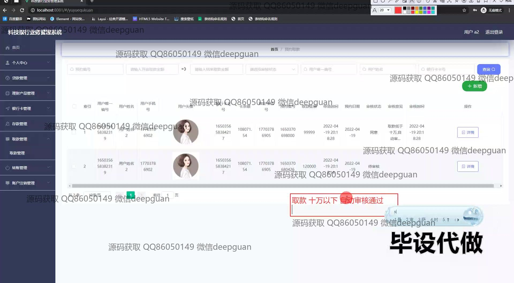
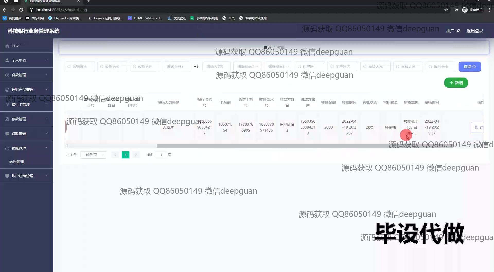
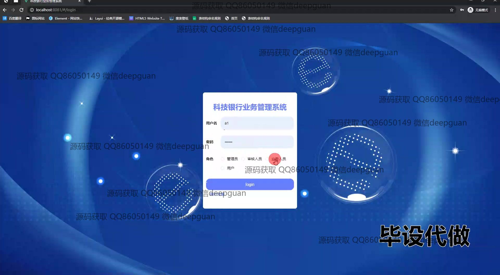

<h1 align="center">科技银行业务管理系统+vue</h1>

## 简介
科技银行业务管理系统：角色分为管理员、审核人员、业务人员；功能包括用户管理、存取款管理、转账管理、理财产品管理、贷款管理，支持信息查询、新增和审核等操作。    --计算机毕业设计源码；毕设源码；java毕业设计源码

## 联系方式

<h3 align="center">获取完整代码与数据库文件 + 微信：deepguan QQ: 86050149 QQ群: 783742310</h3>

<h3 align="center">可帮忙远程部署 包运行成功！提供远程部署、修改代码、设计文档指导、代码讲解等服务！</h3>

## 功能介绍（完整见运行截图）
管理员：负责系统用户权限管理与审核操作，包括登录、角色分配、用户账户审核、理财产品审批、贷款审核以及银行卡挂失处理。管理员可通过左侧导航栏切换至审核管理模块，输入审核意见并提交，同时可查看所有业务记录和系统日志。

审核人员：主要进行业务信息的审核与确认，包括贷款、理财产品、转账等模块的审核操作。审核人员可通过导航栏进入相关模块，填写审核意见，对记录进行审批，支持快速筛选和查看详细信息。

业务人员：处理用户的业务需求，包括新增存款记录、发起贷款申请、理财产品购买登记及转账管理等功能模块。业务人员可以在页面中输入详细的业务信息，并通过提交按钮保存，确保业务的高效处理。

用户：支持基本账户操作，包括登录、注册、个人信息管理、绑定银行卡以及查看账户记录。用户还可以发起存款、取款、转账、理财产品购买等操作，通过系统界面进行详细信息的填写与提交，实现全面的金融业务管理。

## 运行截图

本代码来源于网络,仅供学习参考使用!

